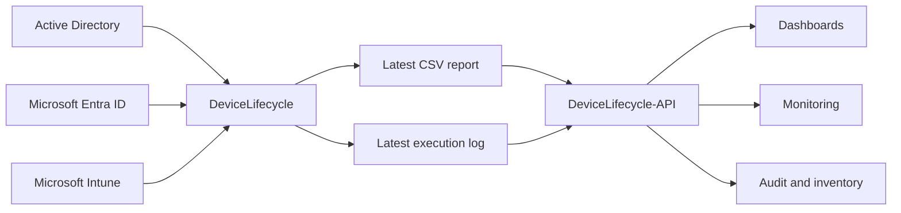
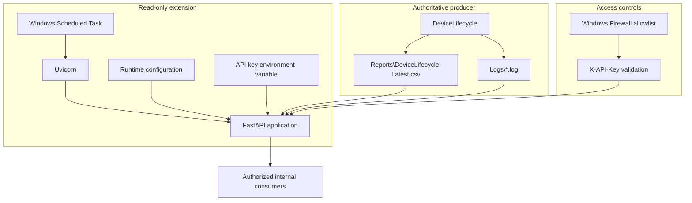

# DeviceLifecycle-API

[](LICENSE)

[English](README.md) | [Português](README.pt-BR.md)

A read-only internal HTTP API that publishes the latest CSV report and execution log produced by [DeviceLifecycle](https://github.com/diogowermann/DeviceLifecycle).

> **Extension boundary:** DeviceLifecycle-API is an optional, separately maintained extension. It depends on files generated by DeviceLifecycle, but DeviceLifecycle does not depend on the API to inventory, quarantine, restore, or remove devices.

> **Security disclaimer:** This repository was prepared for public portfolio use. Company-specific names, credentials, tenant identifiers, addresses, certificates, API keys, and other sensitive values must remain outside version control. Review every default before deploying the service in another environment.

<!-- IMAGE PLACEHOLDER: Add a sanitized screenshot of an API response or internal dashboard consuming the service here. Suggested path: docs/assets/api-overview.png -->

## Overview

DeviceLifecycle produces operational reports and logs while managing inactive hybrid Windows devices across Active Directory, Microsoft Entra ID, and Microsoft Intune. DeviceLifecycle-API exposes the latest generated artifacts to authorized internal consumers without granting those consumers access to the lifecycle automation itself.

Typical consumers include:

- monitoring platforms;
- internal dashboards;
- inventory services;
- audit routines;
- reporting pipelines;
- other authorized infrastructure services.

The API is deliberately narrow: it reads configured local files and returns CSV, JSON, metadata, or plain text. It does not execute PowerShell lifecycle actions and provides no write endpoints.

## Relationship with DeviceLifecycle



| Component | Responsibility |
|---|---|
| `DeviceLifecycle` | Collects signals, correlates identities, decides lifecycle state, and may perform administrative actions. |
| `DeviceLifecycle-API` | Authenticates consumers and publishes existing reports and logs in read-only form. |
| API consumers | Read and format the returned data for their own use cases. |

The authoritative system remains DeviceLifecycle. If this API is stopped or uninstalled, the lifecycle automation continues operating normally.

## Key Features

- Read-only FastAPI application.
- API-key authentication through `X-API-Key`.
- Constant-time key comparison.
- Native CSV delivery without transformation.
- JSON conversion of the latest CSV report.
- Latest-log tail and complete-log endpoints.
- File metadata endpoint.
- Configurable authentication for the health endpoint.
- Stable file reads to avoid returning partially updated content.
- Configurable maximum number of log lines.
- `Cache-Control: no-store` on all responses.
- Swagger UI, ReDoc, and the OpenAPI schema disabled at runtime.
- Rotating API request logs without recording the API key.
- Windows Scheduled Task execution as `SYSTEM`.
- Installer-managed inbound firewall rule restricted to approved consumers.
- API-key rotation script.
- Installation, validation, update, and uninstallation scripts.

## Architecture



<!-- IMAGE PLACEHOLDER: Add a sanitized deployment diagram showing the producer server, firewall boundary, and consumer servers here. Suggested path: docs/assets/deployment-topology.png -->

See [Architecture and engineering decisions](docs/en/ARCHITECTURE.md) for trust boundaries and design rationale.

## Requirements

- DeviceLifecycle installed and executed at least once.
- Windows Server with local access to the DeviceLifecycle report and log directories.
- Windows PowerShell 5.1.
- Python 3.10 or newer available to all users.
- Elevated PowerShell for installation, update, key rotation, or removal.
- Internet access during dependency installation from PyPI, unless dependencies are provided through an internal package source.

Python dependencies:

- FastAPI `>=0.115,<1.0`;
- Uvicorn `>=0.30,<1.0` with standard extras.

## Configuration

Use the same `OrganizationName` configured in DeviceLifecycle.

Edit `DeviceLifecycleApi.Config.psd1`:

```powershell
@{
    OrganizationName = 'orgname'

    ListenAddress = '0.0.0.0'
    Port = 8088

    RemoteAddress = @(
        '192.168.1.20',
        '192.168.1.21'
    )

    MaxLogLines = 5000
    HealthRequiresAuthentication = $false
}
```

The organization name is used to derive the default paths and Windows object names:

| Resource | Derived value |
|---|---|
| DeviceLifecycle data | `C:\ProgramData\{OrganizationName}\DeviceLifecycle` |
| API installation | `C:\Program Files\{OrganizationName}\DeviceLifecycle-API` |
| Runtime configuration | `C:\ProgramData\{OrganizationName}\DeviceLifecycleApi` |
| Scheduled Task | `{OrganizationName} - Device Lifecycle API` |
| Firewall rule | `{OrganizationName} - Device Lifecycle API` |

Every derived value can be overridden in the configuration file.

> An empty `RemoteAddress` array creates no inbound firewall rule. Configure explicit approved consumer addresses before enabling remote access.

## Installation

Place the repository on the DeviceLifecycle server, review the configuration, and run PowerShell as administrator:

```powershell
Set-ExecutionPolicy Bypass -Scope Process -Force

.\Install-DeviceLifecycleApi.ps1 -Force
```

Consumer addresses can also be overridden for a single installation run:

```powershell
.\Install-DeviceLifecycleApi.ps1 `
    -RemoteAddress '192.168.1.20','192.168.1.21' `
    -Force
```

The installer:

1. validates the DeviceLifecycle report and log sources;
2. validates Python 3.10 or newer;
3. creates the installation directory;
4. creates a Python virtual environment;
5. installs FastAPI and Uvicorn;
6. generates a random 64-character hexadecimal API key;
7. writes runtime configuration outside the repository;
8. registers a startup Scheduled Task running as `SYSTEM`;
9. creates a restricted inbound firewall rule when consumer addresses are configured;
10. starts the API.

The generated API key must not be committed to source control, placed in screenshots, or written to tickets and documentation.

## Validation

Run the installed validation script:

```powershell
& 'C:\Program Files\orgname\DeviceLifecycle-API\Test-DeviceLifecycleApi.ps1'
```

The validation covers configuration, the API key, source files, the Scheduled Task, and the primary endpoints.

## Endpoints

Base URL:

```text
http://SERVER:8088/api/v1
```

| Method | Endpoint | Authentication | Response |
|---|---|---|---|
| `GET` | `/health` | Optional/configurable | API and source-file availability |
| `GET` | `/metadata` | `X-API-Key` | Report and latest-log metadata |
| `GET` | `/report.csv` | `X-API-Key` | Original CSV without transformation |
| `GET` | `/report` | `X-API-Key` | CSV converted to JSON |
| `GET` | `/log?lines=500` | `X-API-Key` | Latest log tail as plain text |
| `GET` | `/log/file` | `X-API-Key` | Complete latest log as plain text |

See the complete [HTTP API contract](docs/en/API.md).

## Usage Examples

### PowerShell — JSON report

```powershell
$headers = @{
    'X-API-Key' = 'PASTE-THE-KEY-HERE'
}

$report = Invoke-RestMethod `
    -Uri 'http://device-server:8088/api/v1/report' `
    -Headers $headers

$report.recordCount
$report.records
```

### PowerShell — original CSV

```powershell
$response = Invoke-WebRequest `
    -Uri 'http://device-server:8088/api/v1/report.csv' `
    -Headers $headers `
    -UseBasicParsing

$response.Content
```

### PowerShell — latest log tail

```powershell
$log = Invoke-WebRequest `
    -Uri 'http://device-server:8088/api/v1/log?lines=200' `
    -Headers $headers `
    -UseBasicParsing

$log.Content
```

<!-- IMAGE PLACEHOLDER: Add sanitized examples of the health, metadata, and report responses here. Never expose the API key. Suggested path: docs/assets/response-examples.png -->

## API-Key Rotation

```powershell
& 'C:\Program Files\orgname\DeviceLifecycle-API\Reset-DeviceLifecycleApiKey.ps1'
```

The Scheduled Task is restarted automatically. Every consumer must be updated with the new key.

## Runtime Configuration and Logs

Runtime configuration:

```text
C:\ProgramData\{OrganizationName}\DeviceLifecycleApi\Api.Config.json
```

API logs:

```text
C:\ProgramData\{OrganizationName}\DeviceLifecycleApi\Logs\DeviceLifecycleApi.log
```

The API log rotates at 5 MB and retains five previous files. The API key is not written to the log.

The generated JSON file is operational runtime configuration. It does not replace the version-controlled `DeviceLifecycleApi.Config.psd1` template.

## Security Model

- The API has no write endpoints.
- It does not contact AD, Entra ID, Intune, or Microsoft Graph.
- Data endpoints require `X-API-Key`.
- The key is compared using a constant-time operation.
- Clients cannot submit arbitrary filesystem paths.
- Configured relative source paths reject absolute paths and parent-directory traversal.
- File reads verify size and modification timestamps before returning data.
- The Windows Firewall rule should be restricted to explicit consumer addresses.
- API documentation interfaces are disabled in runtime.
- Responses are marked `no-store` and `nosniff`.
- HTTP is intended only for trusted internal networks. Use an HTTPS reverse proxy for untrusted or routed networks.

Read [SECURITY.md](SECURITY.md) before deploying the service.

## Uninstallation

Preview removal:

```powershell
& 'C:\Program Files\orgname\DeviceLifecycle-API\Uninstall-DeviceLifecycleApi.ps1' -WhatIf
```

Remove the API, runtime configuration, and API key:

```powershell
& 'C:\Program Files\orgname\DeviceLifecycle-API\Uninstall-DeviceLifecycleApi.ps1' `
    -RemoveConfiguration `
    -RemoveApiKey
```

Uninstalling this extension does not remove DeviceLifecycle, its reports, its logs, or its `state.json`.

## Project Structure

```text
DeviceLifecycle-API/
|-- app/
|   `-- main.py
|-- docs/
|   |-- en/
|   |   |-- API.md
|   |   `-- ARCHITECTURE.md
|   |-- pt-BR/
|   |   |-- API.md
|   |   `-- ARCHITECTURE.md
|   `-- assets/
|-- Examples/
|   `-- Query-DeviceLifecycleApi.ps1
|-- DeviceLifecycleApi.Config.psd1
|-- DeviceLifecycleApi.Helpers.psm1
|-- Install-DeviceLifecycleApi.ps1
|-- Reset-DeviceLifecycleApiKey.ps1
|-- Start-DeviceLifecycleApi.ps1
|-- Test-DeviceLifecycleApi.ps1
|-- Uninstall-DeviceLifecycleApi.ps1
|-- requirements.txt
|-- CHANGELOG.md
|-- LICENSE
|-- README.md
|-- README.pt-BR.md
`-- SECURITY.md
```

## Documentation

- [HTTP API contract](docs/en/API.md)
- [Architecture and engineering decisions](docs/en/ARCHITECTURE.md)
- [Portuguese documentation](README.pt-BR.md)
- [Security policy](SECURITY.md)
- [Changelog](CHANGELOG.md)
- [Main DeviceLifecycle repository](https://github.com/diogowermann/DeviceLifecycle)

## Planned Portfolio Assets

Sanitized screenshots will be added after the test environment is stable. Search for `IMAGE PLACEHOLDER` to locate all planned insertion points.

## License

Distributed under the [MIT License](LICENSE).

## Author

Developed by [Diogo Wermann](https://github.com/diogowermann) as part of a Windows endpoint management, identity, API, and infrastructure automation portfolio.
