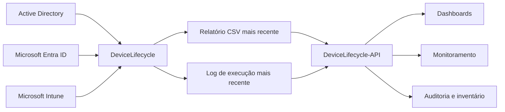
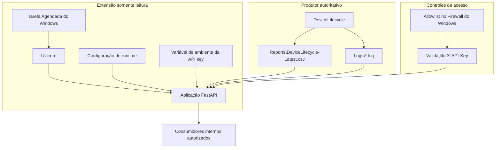

# DeviceLifecycle-API

[](LICENSE)

[English](README.md) | [Português](README.pt-BR.md)

API HTTP interna e somente leitura para publicar o relatório CSV e o log de execução mais recentes gerados pelo [DeviceLifecycle](https://github.com/diogowermann/DeviceLifecycle).

> **Limite da extensão:** o DeviceLifecycle-API é uma extensão opcional, mantida em repositório separado. Ele depende dos arquivos produzidos pelo DeviceLifecycle, mas o DeviceLifecycle não depende da API para inventariar, colocar em quarentena, restaurar ou remover dispositivos.

> **Aviso de segurança:** este repositório foi preparado para uso público em portfólio. Nomes específicos da empresa, credenciais, identificadores do tenant, endereços, certificados, API keys e outros valores sensíveis devem permanecer fora do controle de versão. Revise todos os padrões antes de implantar o serviço em outro ambiente.

<!-- IMAGE PLACEHOLDER: Adicionar aqui uma captura sanitizada de uma resposta da API ou de um dashboard interno consumindo o serviço. Caminho sugerido: docs/assets/api-overview.png -->

## Visão geral

O DeviceLifecycle produz relatórios operacionais e logs enquanto gerencia dispositivos Windows híbridos inativos entre Active Directory, Microsoft Entra ID e Microsoft Intune. O DeviceLifecycle-API expõe os artefatos mais recentes para consumidores internos autorizados sem conceder acesso à automação de ciclo de vida.

Consumidores típicos:

- plataformas de monitoramento;
- dashboards internos;
- serviços de inventário;
- rotinas de auditoria;
- pipelines de relatórios;
- outros serviços de infraestrutura autorizados.

A API possui escopo deliberadamente restrito: lê arquivos locais configurados e retorna CSV, JSON, metadados ou texto puro. Ela não executa ações PowerShell do ciclo de vida e não possui endpoints de escrita.

## Relação com o DeviceLifecycle



| Componente | Responsabilidade |
|---|---|
| `DeviceLifecycle` | Coleta sinais, correlaciona identidades, decide o estado do ciclo de vida e pode executar ações administrativas. |
| `DeviceLifecycle-API` | Autentica consumidores e publica relatórios e logs existentes em modo somente leitura. |
| Consumidores | Leem e formatam os dados retornados para seus próprios casos de uso. |

A fonte autoritativa permanece sendo o DeviceLifecycle. Se a API for parada ou removida, a automação principal continua funcionando normalmente.

## Principais recursos

- Aplicação FastAPI somente leitura.
- Autenticação por API key no cabeçalho `X-API-Key`.
- Comparação da chave em tempo constante.
- Entrega do CSV original sem transformação.
- Conversão do relatório CSV mais recente para JSON.
- Endpoints para últimas linhas e arquivo completo do log.
- Endpoint de metadados dos arquivos.
- Autenticação configurável no endpoint de health check.
- Leitura estável para evitar retorno de arquivos parcialmente atualizados.
- Limite configurável de linhas do log.
- `Cache-Control: no-store` em todas as respostas.
- Swagger UI, ReDoc e schema OpenAPI desabilitados em runtime.
- Logs rotativos de requisições sem registrar a API key.
- Execução por Tarefa Agendada do Windows como `SYSTEM`.
- Regra de firewall criada pelo instalador e restrita aos consumidores aprovados.
- Script de rotação da API key.
- Scripts de instalação, validação, atualização e desinstalação.

## Arquitetura



<!-- IMAGE PLACEHOLDER: Adicionar aqui um diagrama sanitizado da implantação mostrando o servidor produtor, o limite de firewall e os servidores consumidores. Caminho sugerido: docs/assets/deployment-topology.png -->

Consulte [Arquitetura e decisões de engenharia](docs/pt-BR/ARCHITECTURE.md) para detalhes sobre limites de confiança e decisões do projeto.

## Requisitos

- DeviceLifecycle instalado e executado pelo menos uma vez.
- Windows Server com acesso local aos diretórios de relatório e logs do DeviceLifecycle.
- Windows PowerShell 5.1.
- Python 3.10 ou superior disponível para todos os usuários.
- PowerShell elevado para instalação, atualização, rotação da chave ou remoção.
- Acesso à internet durante a instalação das dependências pelo PyPI, exceto quando houver um repositório interno de pacotes.

Dependências Python:

- FastAPI `>=0.115,<1.0`;
- Uvicorn `>=0.30,<1.0` com extras padrão.

## Configuração

Use o mesmo `OrganizationName` configurado no DeviceLifecycle.

Edite `DeviceLifecycleApi.Config.psd1`:

```powershell
@{
    OrganizationName = 'orgname'

    ListenAddress = '0.0.0.0'
    Port = 8088

    RemoteAddress = @(
        '192.168.1.20',
        '192.168.1.21'
    )

    MaxLogLines = 5000
    HealthRequiresAuthentication = $false
}
```

O nome da organização é usado para derivar caminhos e nomes de objetos do Windows:

| Recurso | Valor derivado |
|---|---|
| Dados do DeviceLifecycle | `C:\ProgramData\{OrganizationName}\DeviceLifecycle` |
| Instalação da API | `C:\Program Files\{OrganizationName}\DeviceLifecycle-API` |
| Configuração de runtime | `C:\ProgramData\{OrganizationName}\DeviceLifecycleApi` |
| Tarefa Agendada | `{OrganizationName} - Device Lifecycle API` |
| Regra de firewall | `{OrganizationName} - Device Lifecycle API` |

Todos os valores derivados podem ser sobrescritos no arquivo de configuração.

> Um array `RemoteAddress` vazio não cria regra de entrada no firewall. Configure explicitamente os endereços dos consumidores aprovados antes de habilitar acesso remoto.

## Instalação

Coloque o repositório no servidor do DeviceLifecycle, revise a configuração e execute o PowerShell como administrador:

```powershell
Set-ExecutionPolicy Bypass -Scope Process -Force

.\Install-DeviceLifecycleApi.ps1 -Force
```

Os endereços dos consumidores também podem ser sobrescritos em uma execução específica:

```powershell
.\Install-DeviceLifecycleApi.ps1 `
    -RemoteAddress '192.168.1.20','192.168.1.21' `
    -Force
```

O instalador:

1. valida as fontes de relatório e logs do DeviceLifecycle;
2. valida Python 3.10 ou superior;
3. cria o diretório de instalação;
4. cria um ambiente virtual Python;
5. instala FastAPI e Uvicorn;
6. gera uma API key hexadecimal aleatória com 64 caracteres;
7. grava a configuração de runtime fora do repositório;
8. registra uma Tarefa Agendada na inicialização executada como `SYSTEM`;
9. cria uma regra de firewall restrita quando endereços consumidores são configurados;
10. inicia a API.

A API key gerada não deve ser versionada, incluída em capturas de tela ou registrada em chamados e documentos.

## Validação

Execute o script instalado de validação:

```powershell
& 'C:\Program Files\orgname\DeviceLifecycle-API\Test-DeviceLifecycleApi.ps1'
```

A validação cobre configuração, API key, arquivos de origem, Tarefa Agendada e endpoints principais.

## Endpoints

URL base:

```text
http://SERVIDOR:8088/api/v1
```

| Método | Endpoint | Autenticação | Resposta |
|---|---|---|---|
| `GET` | `/health` | Opcional/configurável | Disponibilidade da API e das fontes |
| `GET` | `/metadata` | `X-API-Key` | Metadados do relatório e do log mais recente |
| `GET` | `/report.csv` | `X-API-Key` | CSV original sem transformação |
| `GET` | `/report` | `X-API-Key` | CSV convertido para JSON |
| `GET` | `/log?lines=500` | `X-API-Key` | Últimas linhas do log em texto puro |
| `GET` | `/log/file` | `X-API-Key` | Log completo mais recente em texto puro |

Consulte o [contrato HTTP completo](docs/pt-BR/API.md).

## Exemplos de uso

### PowerShell — relatório JSON

```powershell
$headers = @{
    'X-API-Key' = 'COLE-A-CHAVE-AQUI'
}

$report = Invoke-RestMethod `
    -Uri 'http://servidor-dispositivos:8088/api/v1/report' `
    -Headers $headers

$report.recordCount
$report.records
```

### PowerShell — CSV original

```powershell
$response = Invoke-WebRequest `
    -Uri 'http://servidor-dispositivos:8088/api/v1/report.csv' `
    -Headers $headers `
    -UseBasicParsing

$response.Content
```

### PowerShell — últimas linhas do log

```powershell
$log = Invoke-WebRequest `
    -Uri 'http://servidor-dispositivos:8088/api/v1/log?lines=200' `
    -Headers $headers `
    -UseBasicParsing

$log.Content
```

<!-- IMAGE PLACEHOLDER: Adicionar exemplos sanitizados das respostas de health, metadata e report. Nunca expor a API key. Caminho sugerido: docs/assets/response-examples.png -->

## Rotação da API key

```powershell
& 'C:\Program Files\orgname\DeviceLifecycle-API\Reset-DeviceLifecycleApiKey.ps1'
```

A Tarefa Agendada é reiniciada automaticamente. Todos os consumidores devem receber a nova chave.

## Configuração de runtime e logs

Configuração de runtime:

```text
C:\ProgramData\{OrganizationName}\DeviceLifecycleApi\Api.Config.json
```

Logs da API:

```text
C:\ProgramData\{OrganizationName}\DeviceLifecycleApi\Logs\DeviceLifecycleApi.log
```

O log da API rotaciona em 5 MB e mantém cinco arquivos anteriores. A API key não é registrada.

O arquivo JSON gerado é configuração operacional de runtime. Ele não substitui o template versionado `DeviceLifecycleApi.Config.psd1`.

## Modelo de segurança

- A API não possui endpoints de escrita.
- Ela não acessa AD, Entra ID, Intune ou Microsoft Graph.
- Endpoints de dados exigem `X-API-Key`.
- A chave é comparada por operação em tempo constante.
- Clientes não podem informar caminhos arbitrários do sistema de arquivos.
- Caminhos relativos configurados rejeitam caminhos absolutos e navegação para diretórios pai.
- A leitura verifica tamanho e timestamp antes de retornar os dados.
- A regra do Firewall do Windows deve ser restrita a endereços consumidores explícitos.
- Interfaces de documentação da API permanecem desabilitadas em runtime.
- Respostas são marcadas com `no-store` e `nosniff`.
- HTTP deve ser usado somente em redes internas confiáveis. Para redes não confiáveis ou roteadas, use reverse proxy HTTPS.

Leia [SECURITY.md](SECURITY.md) antes de implantar o serviço.

## Desinstalação

Simular a remoção:

```powershell
& 'C:\Program Files\orgname\DeviceLifecycle-API\Uninstall-DeviceLifecycleApi.ps1' -WhatIf
```

Remover a API, a configuração de runtime e a API key:

```powershell
& 'C:\Program Files\orgname\DeviceLifecycle-API\Uninstall-DeviceLifecycleApi.ps1' `
    -RemoveConfiguration `
    -RemoveApiKey
```

A desinstalação da extensão não remove o DeviceLifecycle, seus relatórios, logs ou `state.json`.

## Estrutura do projeto

```text
DeviceLifecycle-API/
|-- app/
|   `-- main.py
|-- docs/
|   |-- en/
|   |   |-- API.md
|   |   `-- ARCHITECTURE.md
|   |-- pt-BR/
|   |   |-- API.md
|   |   `-- ARCHITECTURE.md
|   `-- assets/
|-- Examples/
|   `-- Query-DeviceLifecycleApi.ps1
|-- DeviceLifecycleApi.Config.psd1
|-- DeviceLifecycleApi.Helpers.psm1
|-- Install-DeviceLifecycleApi.ps1
|-- Reset-DeviceLifecycleApiKey.ps1
|-- Start-DeviceLifecycleApi.ps1
|-- Test-DeviceLifecycleApi.ps1
|-- Uninstall-DeviceLifecycleApi.ps1
|-- requirements.txt
|-- CHANGELOG.md
|-- LICENSE
|-- README.md
|-- README.pt-BR.md
`-- SECURITY.md
```

## Documentação

- [Contrato HTTP](docs/pt-BR/API.md)
- [Arquitetura e decisões de engenharia](docs/pt-BR/ARCHITECTURE.md)
- [English documentation](README.md)
- [Política de segurança](SECURITY.md)
- [Changelog](CHANGELOG.md)
- [Repositório principal DeviceLifecycle](https://github.com/diogowermann/DeviceLifecycle)

## Imagens planejadas para o portfólio

Capturas sanitizadas serão adicionadas depois que o ambiente de testes estiver estável. Pesquise por `IMAGE PLACEHOLDER` para localizar todos os pontos planejados.

## Licença

Distribuído sob a [Licença MIT](LICENSE).

## Autor

Desenvolvido por [Diogo Wermann](https://github.com/diogowermann) como parte de um portfólio de gerenciamento de endpoints Windows, identidade, APIs e automação de infraestrutura.
