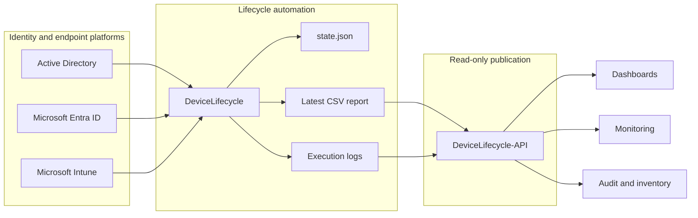
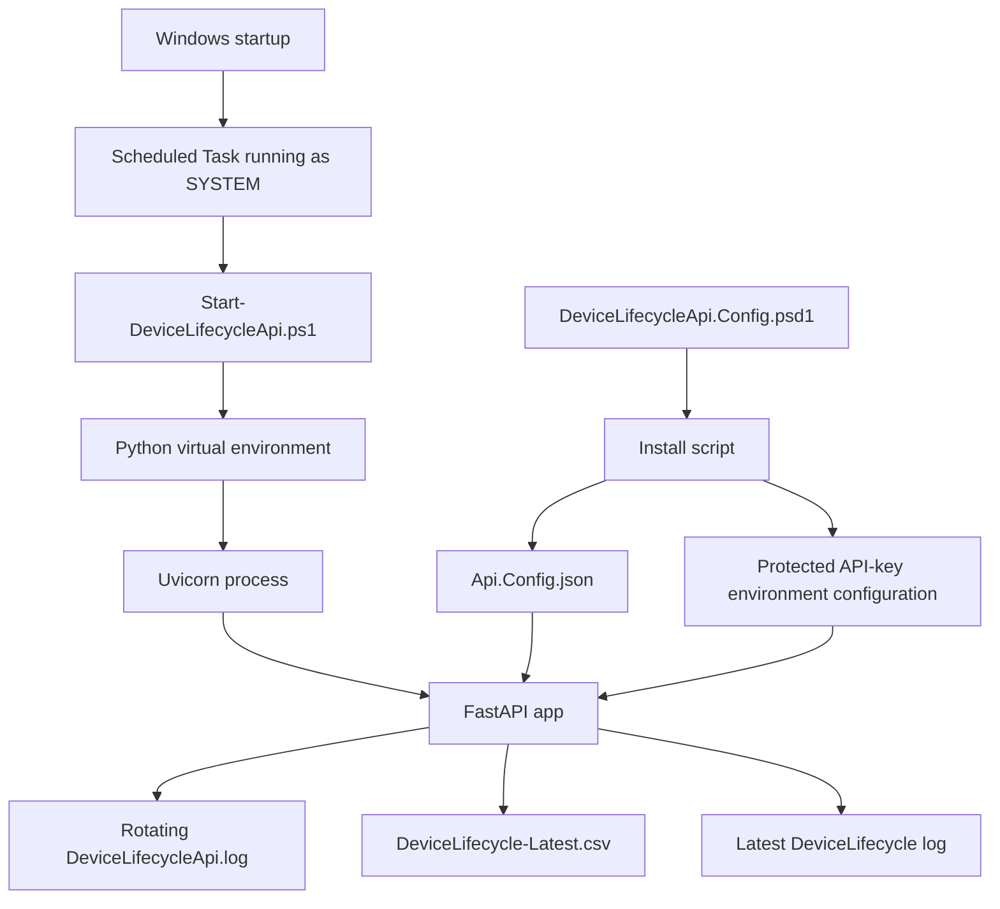
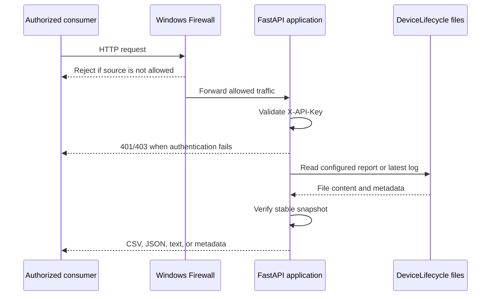
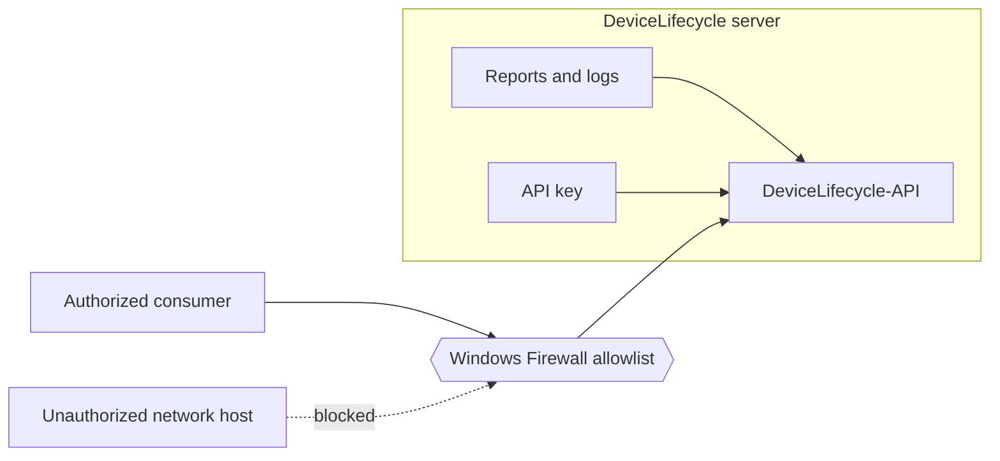
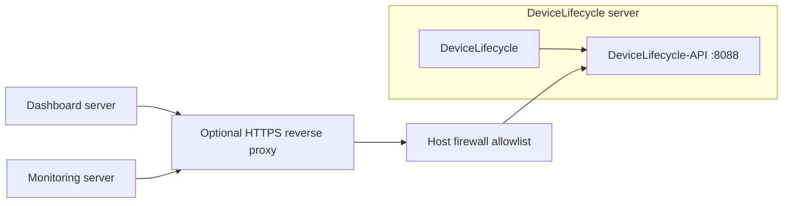

# DeviceLifecycle-API Architecture

[English](ARCHITECTURE.md) | [Português](../pt-BR/ARCHITECTURE.md)

## Purpose

DeviceLifecycle-API separates data publication from lifecycle enforcement.

The main [DeviceLifecycle](https://github.com/diogowermann/DeviceLifecycle) service interacts with Active Directory, Microsoft Entra ID, Microsoft Intune, and Microsoft Graph. It correlates identities, evaluates activity, maintains persistent state, and may perform administrative actions.

DeviceLifecycle-API does none of those things. It reads the latest report and log produced by the main service and publishes them through a narrow authenticated HTTP interface.

This separation provides a smaller attack surface for consumers and prevents reporting integrations from requiring administrative access to the lifecycle process.

## System Context

The API cannot reach the identity and endpoint platforms through its application code. Its source of truth is the filesystem output generated by DeviceLifecycle.

## Responsibility Boundaries

### DeviceLifecycle

- Collects device data from AD, Entra ID, and Intune.
- Correlates records using stable identifiers.
- Evaluates inactivity and lifecycle state.
- May retire, disable, move, restore, or delete devices according to its configured mode.
- Produces CSV reports, execution logs, and persistent state.
- Remains the authoritative service.

### DeviceLifecycle-API

- Reads only the configured latest report and log directory.
- Authenticates consumers using `X-API-Key`.
- Returns CSV, JSON, plain text, or metadata.
- Records request metadata in its own rotating log.
- Never writes to DeviceLifecycle files.
- Does not expose `state.json`.
- Does not execute PowerShell lifecycle scripts.
- Does not provide generic filesystem access.
- Does not provide write endpoints.

### Consumers

- Store and protect the API key.
- Respect the read-only contract.
- Apply their own presentation, filtering, retention, and alerting logic.
- Must not treat the API as the authoritative lifecycle engine.

## Runtime Components

The version-controlled PSD1 file is an administrative template. Installation converts it into runtime configuration outside the repository.

## Request Flow

For the health endpoint, API-key validation is optional and controlled by configuration.

## Trust Boundaries

Primary trust boundaries:

1. **Filesystem boundary:** the API is restricted to configured source paths under `DataRoot`.
2. **Host boundary:** runtime configuration and the key remain outside the repository on the Windows server.
3. **Network boundary:** the inbound firewall rule should allow only explicit consumers.
4. **Application boundary:** data endpoints require API-key authentication.
5. **Transport boundary:** HTTP is acceptable only inside a trusted network; HTTPS is required when that assumption is invalid.

## Path Safety

Clients cannot provide a path.

The application accepts only administratively configured relative paths for the report and log directory. Configuration loading rejects:

- absolute paths;
- drive-qualified paths;
- paths containing parent traversal (`..`).

This prevents the HTTP interface from becoming a generic file-download endpoint.

## Stable Snapshot Reads

DeviceLifecycle may replace or update its report and logs while the API is running. Returning a file during a write could expose truncated or inconsistent data.

The API therefore:

1. reads file metadata;
2. reads the content;
3. reads metadata again;
4. accepts the result only when size and modification timestamp remain unchanged;
5. retries when the file changed;
6. returns `503` after retries are exhausted.

This favors consistency over returning potentially partial data.

## Authentication Design

The installer generates 32 random bytes and represents them as a 64-character hexadecimal key.

The key:

- is supplied through `X-API-Key`;
- must contain at least 32 characters;
- is compared using `hmac.compare_digest`;
- is not written to the request log;
- can be rotated using `Reset-DeviceLifecycleApiKey.ps1`.

The key is a shared secret, not an identity protocol. For larger environments, an API gateway, mutual TLS, or an identity-aware reverse proxy may be more appropriate.

## Network Model

Recommended deployment:

For a strictly trusted local network, consumers may connect directly through the restricted firewall rule. For routed, cross-site, wireless, cloud, or otherwise untrusted paths, terminate HTTPS before traffic reaches the API.

## Failure Behavior

The service fails conservatively:

| Condition | Behavior |
|---|---|
| Missing API key | `401` |
| Invalid API key | `403` |
| Missing report | `404` |
| Missing log directory or log | `404` |
| Invalid `lines` value | `422` |
| Invalid CSV encoding or format | `422` |
| File changes repeatedly during read | `503` |
| Missing or invalid startup configuration | Application startup fails |
| API unavailable | DeviceLifecycle continues operating |

The API never attempts to recreate, modify, or repair source files.

## Logging and Observability

The API records:

- request method;
- request path;
- client address;
- response status;
- duration in milliseconds;
- unexpected exception details.

The API key is not logged.

Logs rotate at 5 MB and retain five previous files. Source DeviceLifecycle logs remain separate from API request logs.

## Security Headers and Documentation Surface

All responses receive:

- `Cache-Control: no-store`;
- `X-Content-Type-Options: nosniff`;
- `X-DeviceLifecycle-API-Version`.

FastAPI Swagger UI, ReDoc, and OpenAPI schema endpoints are disabled at runtime. The version-controlled API contract remains the intended documentation surface.

## Engineering Decisions

### Separate repository

The API is maintained independently because it has a distinct runtime, dependency model, network exposure, and release lifecycle. The separation also makes it explicit that DeviceLifecycle does not require HTTP exposure.

### Read-only contract

No endpoint can trigger lifecycle execution or modify a device. This minimizes the consequences of a compromised consumer key.

### Filesystem integration

The API consumes generated files rather than duplicating AD, Entra, Intune, and Graph access. This avoids additional privileged application permissions and keeps lifecycle decisions in one authoritative service.

### Windows Scheduled Task

A startup task provides a native deployment model for the Windows Server that already hosts DeviceLifecycle, without introducing a separate service wrapper.

### Disabled interactive API documentation

Disabling Swagger, ReDoc, and OpenAPI reduces unnecessary runtime surface. Consumers use the repository contract instead.

### Explicit consumer allowlist

The installer can create a host firewall rule limited to configured IP addresses. Network restriction complements, but does not replace, API-key authentication.

## Future Considerations

Potential future improvements, without changing the current `v1` contract:

- HTTPS automation or documented reverse-proxy examples;
- structured authentication through an internal identity provider;
- request rate limiting at a reverse proxy or gateway;
- metrics endpoint with no sensitive payload data;
- automated contract tests;
- dependency lock or reproducible package artifact;
- Windows service packaging where operationally justified.

<!-- IMAGE PLACEHOLDER: Add a sanitized real deployment topology after the test environment is finalized. Suggested path: docs/assets/real-deployment-topology.png -->
