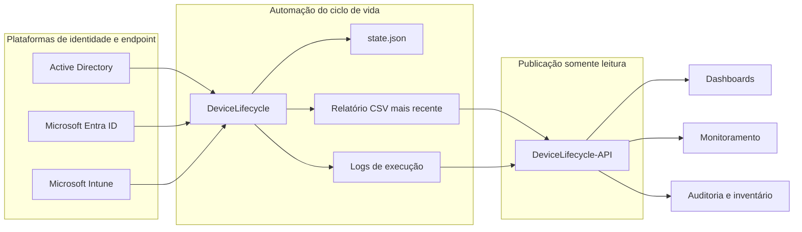
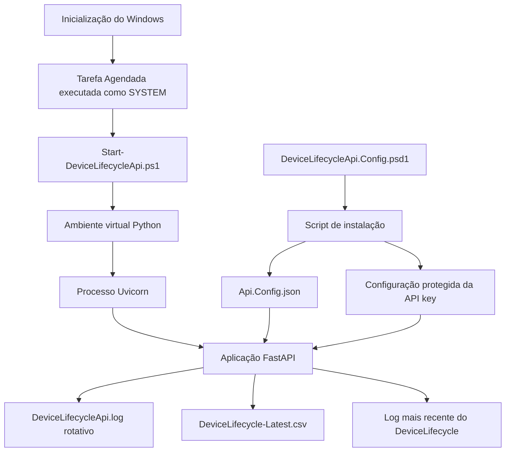
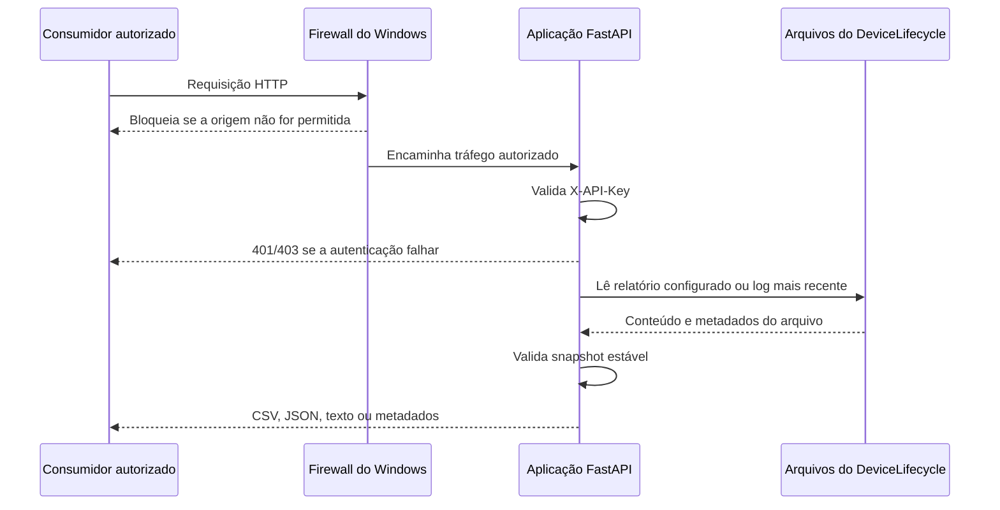
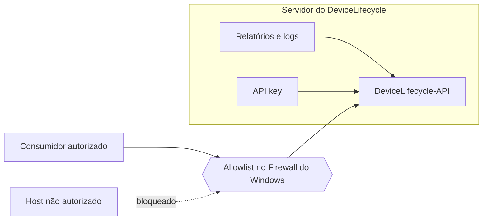
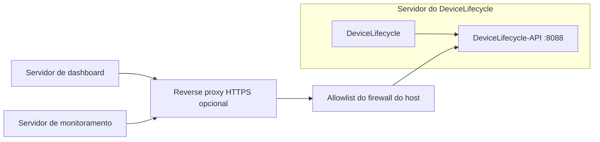

# Arquitetura do DeviceLifecycle-API

[English](../en/ARCHITECTURE.md) | [Português](ARCHITECTURE.md)

## Objetivo

O DeviceLifecycle-API separa a publicação de dados da aplicação do ciclo de vida.

O serviço principal [DeviceLifecycle](https://github.com/diogowermann/DeviceLifecycle) interage com Active Directory, Microsoft Entra ID, Microsoft Intune e Microsoft Graph. Ele correlaciona identidades, avalia atividade, mantém estado persistente e pode executar ações administrativas.

O DeviceLifecycle-API não realiza nenhuma dessas operações. Ele lê o relatório e o log mais recentes produzidos pelo serviço principal e os publica por uma interface HTTP autenticada e restrita.

Essa separação reduz a superfície de ataque dos consumidores e evita que integrações de relatório precisem de acesso administrativo ao processo de ciclo de vida.

## Contexto do sistema

O código da API não acessa as plataformas de identidade e endpoint. Sua fonte de dados é a saída no sistema de arquivos produzida pelo DeviceLifecycle.

## Limites de responsabilidade

### DeviceLifecycle

- Coleta dados de dispositivos do AD, Entra ID e Intune.
- Correlaciona registros por identificadores estáveis.
- Avalia inatividade e estado do ciclo de vida.
- Pode retirar, desabilitar, mover, restaurar ou excluir dispositivos conforme o modo configurado.
- Produz relatórios CSV, logs de execução e estado persistente.
- Permanece sendo o serviço autoritativo.

### DeviceLifecycle-API

- Lê somente o relatório configurado e o diretório de logs.
- Autentica consumidores usando `X-API-Key`.
- Retorna CSV, JSON, texto puro ou metadados.
- Registra metadados das requisições em log rotativo próprio.
- Nunca grava nos arquivos do DeviceLifecycle.
- Não expõe `state.json`.
- Não executa scripts PowerShell do ciclo de vida.
- Não fornece acesso genérico ao sistema de arquivos.
- Não possui endpoints de escrita.

### Consumidores

- Armazenam e protegem a API key.
- Respeitam o contrato somente leitura.
- Aplicam sua própria lógica de apresentação, filtragem, retenção e alertas.
- Não devem tratar a API como motor autoritativo do ciclo de vida.

## Componentes de runtime

O arquivo PSD1 versionado é um template administrativo. A instalação o converte em configuração de runtime armazenada fora do repositório.

## Fluxo de requisição

No endpoint de health check, a validação da API key é opcional e controlada por configuração.

## Limites de confiança

Principais limites de confiança:

1. **Sistema de arquivos:** a API fica restrita aos caminhos configurados sob `DataRoot`.
2. **Host:** configuração de runtime e chave permanecem fora do repositório no servidor Windows.
3. **Rede:** a regra de entrada deve permitir somente consumidores explícitos.
4. **Aplicação:** endpoints de dados exigem autenticação por API key.
5. **Transporte:** HTTP é aceitável apenas em rede confiável; HTTPS é obrigatório quando essa premissa não for válida.

## Segurança dos caminhos

O cliente não pode informar um caminho.

A aplicação aceita somente caminhos relativos configurados administrativamente para o relatório e o diretório de logs. O carregamento da configuração rejeita:

- caminhos absolutos;
- caminhos com unidade de disco;
- caminhos contendo navegação para o diretório pai (`..`).

Isso impede que a interface HTTP se transforme em um endpoint genérico de download de arquivos.

## Leitura de snapshot estável

O DeviceLifecycle pode substituir ou atualizar seus relatórios e logs enquanto a API está em execução. Retornar um arquivo durante a gravação poderia expor dados truncados ou inconsistentes.

A API, portanto:

1. lê os metadados do arquivo;
2. lê o conteúdo;
3. lê novamente os metadados;
4. aceita o resultado apenas quando tamanho e timestamp permanecem iguais;
5. repete a operação quando o arquivo muda;
6. retorna `503` depois que as tentativas são esgotadas.

A consistência é priorizada em relação ao retorno de conteúdo potencialmente parcial.

## Projeto da autenticação

O instalador gera 32 bytes aleatórios e os representa como uma chave hexadecimal de 64 caracteres.

A chave:

- é enviada por `X-API-Key`;
- deve possuir pelo menos 32 caracteres;
- é comparada usando `hmac.compare_digest`;
- não é gravada no log de requisições;
- pode ser rotacionada com `Reset-DeviceLifecycleApiKey.ps1`.

A chave é um segredo compartilhado, não um protocolo de identidade. Em ambientes maiores, um API gateway, mTLS ou reverse proxy integrado a identidade pode ser mais apropriado.

## Modelo de rede

Implantação recomendada:

Em uma rede local estritamente confiável, os consumidores podem se conectar diretamente pela regra restritiva de firewall. Em caminhos roteados, entre sites, sem fio, em nuvem ou não confiáveis, finalize HTTPS antes de o tráfego alcançar a API.

## Comportamento em falhas

O serviço falha de forma conservadora:

| Condição | Comportamento |
|---|---|
| API key ausente | `401` |
| API key inválida | `403` |
| Relatório ausente | `404` |
| Diretório de logs ou log ausente | `404` |
| Valor de `lines` inválido | `422` |
| Encoding ou formato CSV inválido | `422` |
| Arquivo muda repetidamente durante a leitura | `503` |
| Configuração de inicialização ausente ou inválida | A aplicação não inicia |
| API indisponível | O DeviceLifecycle continua funcionando |

A API nunca tenta recriar, modificar ou reparar os arquivos de origem.

## Logs e observabilidade

A API registra:

- método da requisição;
- caminho da requisição;
- endereço do cliente;
- status da resposta;
- duração em milissegundos;
- detalhes de exceções inesperadas.

A API key não é registrada.

Os logs rotacionam em 5 MB e mantêm cinco arquivos anteriores. Os logs do DeviceLifecycle permanecem separados dos logs de requisição da API.

## Cabeçalhos de segurança e superfície de documentação

Todas as respostas recebem:

- `Cache-Control: no-store`;
- `X-Content-Type-Options: nosniff`;
- `X-DeviceLifecycle-API-Version`.

Swagger UI, ReDoc e endpoints de schema OpenAPI do FastAPI são desabilitados em runtime. O contrato versionado no repositório é a superfície de documentação prevista.

## Decisões de engenharia

### Repositório separado

A API é mantida de forma independente porque possui runtime, dependências, exposição de rede e ciclo de release próprios. A separação também deixa explícito que o DeviceLifecycle não precisa ser exposto por HTTP.

### Contrato somente leitura

Nenhum endpoint pode iniciar o ciclo de vida ou modificar um dispositivo. Isso reduz o impacto de uma chave de consumidor comprometida.

### Integração por arquivos

A API consome arquivos gerados em vez de duplicar acesso ao AD, Entra, Intune e Graph. Isso evita permissões privilegiadas adicionais e mantém as decisões do ciclo de vida em um único serviço autoritativo.

### Tarefa Agendada do Windows

Uma tarefa na inicialização fornece um modelo nativo de implantação para o Windows Server que já hospeda o DeviceLifecycle, sem exigir um wrapper de serviço adicional.

### Documentação interativa desabilitada

Desabilitar Swagger, ReDoc e OpenAPI reduz superfície desnecessária em runtime. Consumidores utilizam o contrato do repositório.

### Allowlist explícita de consumidores

O instalador pode criar uma regra de firewall limitada aos endereços IP configurados. A restrição de rede complementa, mas não substitui, a autenticação por API key.

## Considerações futuras

Possíveis melhorias futuras, sem alterar o contrato `v1` atual:

- automação de HTTPS ou exemplos documentados de reverse proxy;
- autenticação estruturada por provedor interno de identidade;
- rate limiting em reverse proxy ou gateway;
- endpoint de métricas sem dados sensíveis;
- testes automatizados de contrato;
- lock de dependências ou artefato de pacote reproduzível;
- empacotamento como serviço Windows quando houver justificativa operacional.

<!-- IMAGE PLACEHOLDER: Adicionar uma topologia real sanitizada depois que o ambiente de testes estiver finalizado. Caminho sugerido: docs/assets/real-deployment-topology.png -->
